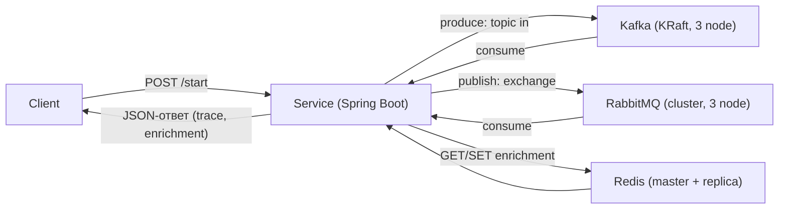

# Event-Driven лабораторный стенд

Стенд для отработки событийной архитектуры: Proxmox (управление VM через
Terraform) → 3 кластера (Kafka/KRaft, RabbitMQ, Redis) → Spring Boot монолит
(Service), который прогоняет сообщение по цепочке
**Kafka → RabbitMQ → Redis** и возвращает обогащённый результат клиенту.

## Состав стенда

| Компонент   | Узлы                                   | Назначение                  |
|-------------|----------------------------------------|-----------------------------|
| Kafka/KRaft | kafka-01..03 (192.168.1.230–.232)     | приём сообщения, шина этапа 1 |
| RabbitMQ    | rabbitmq-01..03 (192.168.1.233–.235)  | маршрутизация, этап 2       |
| Redis       | redis-01..02 (192.168.1.237–.238)     | enrichment + ответ, этап 3  |

ОС VM: Debian 12 genericcloud. Ресурсы каждой VM: 2 vCPU, 2048 MB RAM, 40 GB диск.
Доступ: `ssh -i Security/ed25519 deploy@<IP>`.

## Поток сообщения



## Порядок запуска

```bash
# 1. Инфраструктура: раскатка VM в Proxmox
cd Terraform
cp terraform.tfvars.example terraform.tfvars   # заполнить токен Proxmox
terraform init
terraform plan
terraform apply

# 2. Конфигурация: кластеры и ПО на VM
cd ../Ansible
ansible-playbook playbooks/site.yml

# 3. Сервис: локальный запуск монолита
cd ../Service
mvn spring-boot:run

# 4. Проверка цепочки
curl -X POST http://localhost:8080/start -H 'Content-Type: application/json' \
     -d '{"message":"hello"}'
```

## Разделы репозитория

- [Terraform/](Terraform/) — манифесты раскатки VM в Proxmox
- [Ansible/](Ansible/) — роли, group_vars, playbooks, inventory
- [Service/](Service/) — Java-монолит (Spring Boot, Maven)
- [Security/](Security/) — SSH-ключи доступа к VM
- [docs/runbooks/](docs/runbooks/) — инструкции по диагностике
- [scripts/](scripts/) — вспомогательные скрипты

## Безопасность

- Токен Proxmox, пароли и приватные ключи не коммитятся (см. `.gitignore`).
- Секреты передаются через `terraform.tfvars` (шаблон — `*.tfvars.example`),
  `group_vars` или переменные окружения.
- Изменения на VM — только через Ansible/Terraform (идемпотентно).

## Диагностика

Runbook'ы по типовым проблемам — в [docs/runbooks/](docs/runbooks/).
